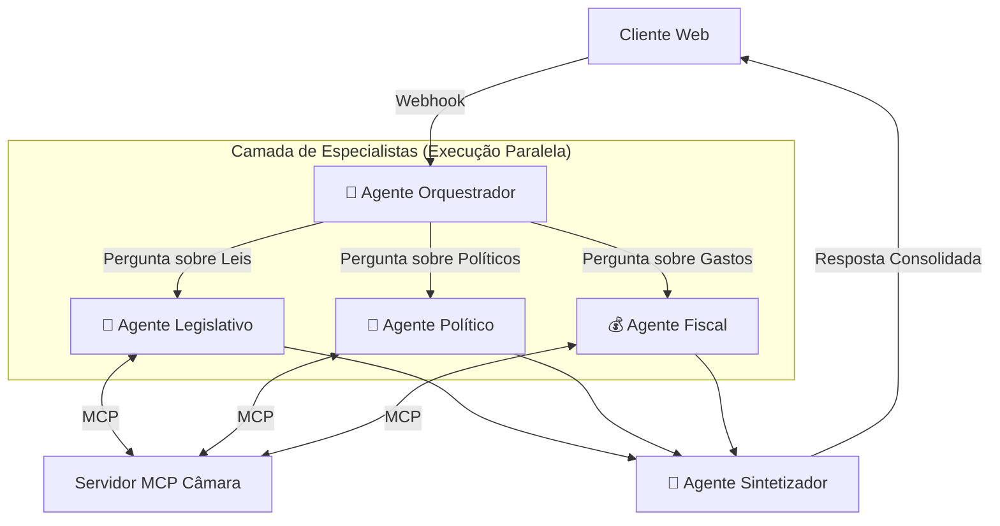
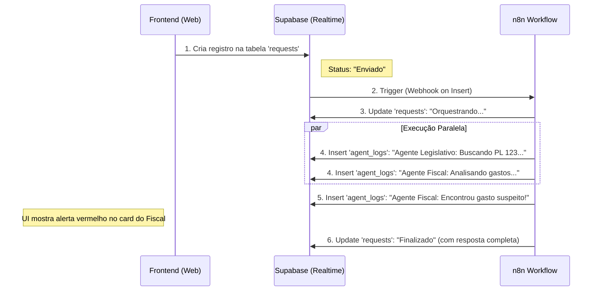

# Proposta de Arquitetura Multi-Agentes: "O Conselho Legislativo"

Esta proposta visa transformar o fluxo atual (linear) em um sistema multi-agentes orquestrado pelo n8n, focado em **paralelismo** (para velocidade) e **especialização** (para qualidade).

## 🏗️ Visão Geral da Arquitetura

Em vez de um único agente "faz-tudo", teremos um **Orquestrador** que delega tarefas para **Especialistas** que trabalham simultaneamente. Um **Sintetizador** consolida tudo no final.

## 🤖 Papéis dos Agentes

### 1. Agente Orquestrador (The Router)
- **Função:** Entender a intenção do usuário e decidir quais especialistas acionar.
- **Ferramentas:** Nenhuma (apenas lógica de roteamento).
- **No n8n:** Pode ser um *AI Agent* simples ou um *Switch Node* inteligente.
- **Ganho:** Evita que agentes desnecessários rodem, economizando tokens e tempo.

### 2. Agentes Especialistas (The Workers)
Estes agentes possuem prompts ultra-específicos e acesso a ferramentas MCP limitadas ao seu escopo.

*   **📜 Agente Legislativo:**
    *   **Foco:** Proposições, tramitações, textos de lei.
    *   **Ferramentas MCP:** `buscar_proposicoes`, `detalhar_proposicao`, `listar_tramitacoes`.
    *   **Prompt:** "Você é um consultor legislativo sênior. Analise o teor das leis, o impacto social e o status atual..."

*   **👔 Agente Político:**
    *   **Foco:** Perfil de deputados, discursos, frentes parlamentares.
    *   **Ferramentas MCP:** `buscar_deputados`, `obter_perfil_completo`, `listar_discursos`.
    *   **Prompt:** "Você é um analista político. Foque nas posições ideológicas, histórico de votação e alianças..."

*   **💰 Agente Fiscal:**
    *   **Foco:** Cota parlamentar, despesas, contratos.
    *   **Ferramentas MCP:** `listar_despesas`, `obter_perfil_completo` (apenas dados financeiros).
    *   **Prompt:** "Você é um auditor fiscal. Procure por anomalias, gastos excessivos ou padrões suspeitos..."

### 3. Agente Sintetizador (The Editor)
- **Função:** Receber as análises parciais dos especialistas e montar a resposta final.
- **Prompt:** "Você é um redator chefe. Receba os relatórios abaixo, elimine redundâncias, resolva contradições e crie um texto coeso, fácil de ler e direto para o cidadão."
- **Ganho de Qualidade:** Garante que o tom de voz seja consistente e que a resposta não pareça uma "colcha de retalhos".

---

# 🌟 Evolução: Arquitetura Transparente (Realtime)

Para trazer o **dinamismo** solicitado e mostrar ao usuário o trabalho de cada agente em tempo real, a arquitetura de "Caixa Preta" (Request -> Response) não serve. Precisamos de uma arquitetura orientada a eventos.

## O Conceito: "Sala de Guerra Transparente"

O usuário não vê apenas a resposta final. Ele vê cards na tela que se iluminam e atualizam conforme cada agente trabalha.

### Nova Infraestrutura Sugerida
Substituir o Webhook simples por um **Banco de Dados Realtime** (como Supabase ou Firebase) servindo como "Barramento de Mensagens".

## Como fica a Experiência do Usuário (UX)

A interface pode ser dividida em colunas ou cards dinâmicos:

1.  **Card do Orquestrador:** Mostra "Entendi sua pergunta. Acionando especialistas em Finanças e Leis."
2.  **Timeline de Ações:**
    *   🔵 *Legislativo:* "Lendo o texto da PEC 32..." (Spinner girando)
    *   🟢 *Fiscal:* "Verificando notas fiscais de 2023..." (Barra de progresso)
    *   ✅ *Fiscal:* "Análise concluída. 2 anomalias encontradas." (Check verde)
3.  **Resposta Final:** O texto consolidado aparece no final, mas o usuário já entendeu o contexto através dos passos anteriores.

## Vantagens desta Abordagem

1.  **Percepção de Velocidade:** Mesmo que demore 10 segundos, o usuário vê atividade imediata ("Agente X iniciou..."), o que reduz a ansiedade da espera.
2.  **Confiança:** Ver o "raciocínio" ou os passos (ex: "Buscando na base de dados X") aumenta a confiança na resposta.
3.  **Engajamento:** É visualmente impressionante e educativo sobre como o sistema funciona.

## Implementação Técnica no n8n

1.  **Trigger:** Ao invés de `Webhook`, use o trigger do Supabase/Firebase ou mantenha o Webhook mas responda imediatamente com um "ID de Job".
2.  **Nós de Update:** Espalhe nós de "HTTP Request" (ou nós nativos do Supabase) pelo seu fluxo do n8n.
    *   Antes de chamar o MCP: `Update Status: "Consultando Câmara..."`
    *   Depois de chamar o MCP: `Update Status: "Dados recebidos. Analisando..."`
3.  **Frontend:** O cliente web assina o canal de websocket do banco de dados e renderiza os eventos conforme chegam.
